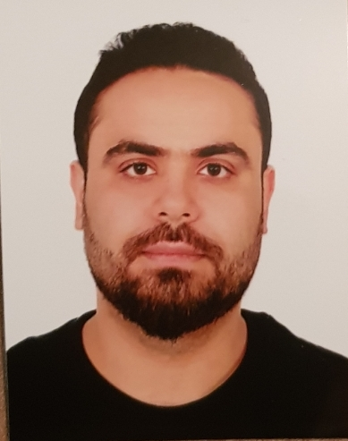

# Bassem Kreidly 

My Address: Baabda-Furn el chebbek  
 Email & phone nb: +961-81-288133 [basem.kreidly@gmail.com](basem.kreidly@gmail.com)
Lebanon

**_"Motivated to learn new topics and able to work in a pressure"_**

---

## Education

=========

2019-2020
**Codi institute learning center (Gimmaizeh)**

2010-2014 (expected)
: **BS, Computer science (IT)**; AOU University (MyTownbADARO)

    *Thesis title: Point of sale system*

2007-2010
: **Bac2, offial lebanese bac2 -With emphasis on Socio-economy SE**;

    *Minor: Awesomeology*

## Work Experience

===============

**Your Most Recent Work Experience:**

Worked in Retail field and Customer service for 8 years:

- Landmark corporate
- Azadia group
- Libanpark SAL corporate. (teamleader)

  [Company Portfolio](https://www.landmark.com)

## Technical Experience

=======================

### Robotics projects:

---

> #### For items which don't have a clear time ordering, a definitionlist can be used to have named items.

> - build a game-hub in a Raspberry pi chip
>
> - building eFAN in a Beaglebone embedded system.
>
> - setup a smart system application
>
> **_Everything done with a high technical skills using high-end devices._**

Programming Languages
: **Computer Skills:** HTML5-CSS3 , Javascript , (C# intermediate level)

: **Technical Skills:** Network++ (basic technical skills in routing and switching)
Cisco certified (security, VOIP)

---

## Languages:

============

     * English good(speaking, reading, writing)
     * Arabic (Native)
     * This is what a nested list looks like.

## Hobbies:

===========

Swimming , Strumming musinc instruments, Surfing the web

## Referance:

============

**Available upon request**
